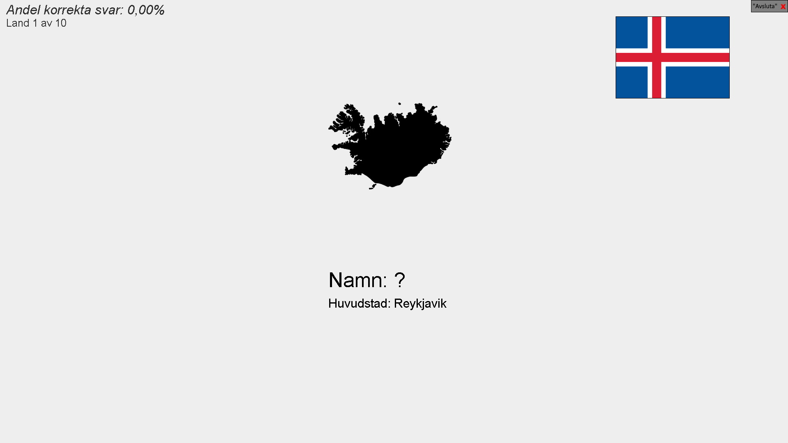
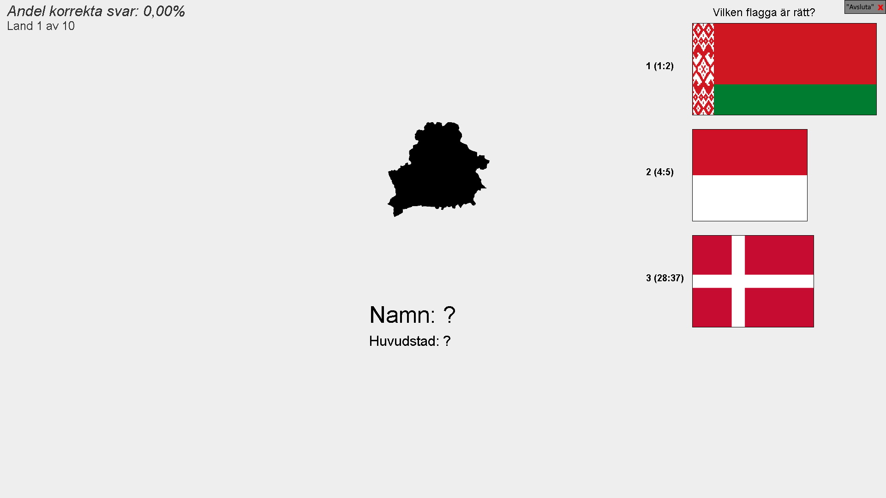
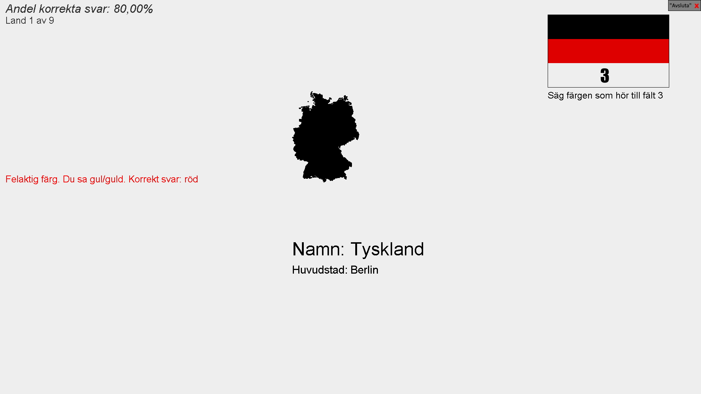
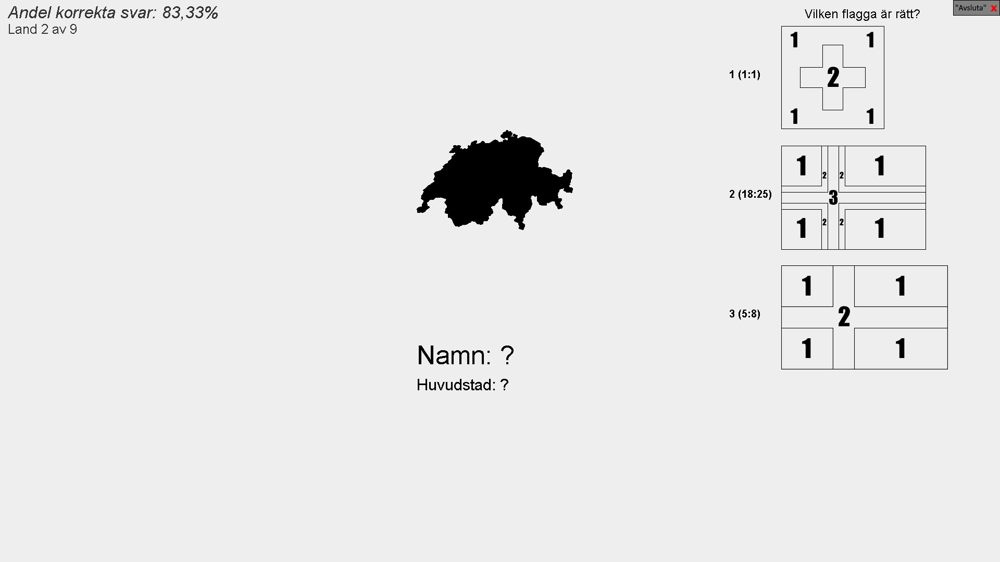
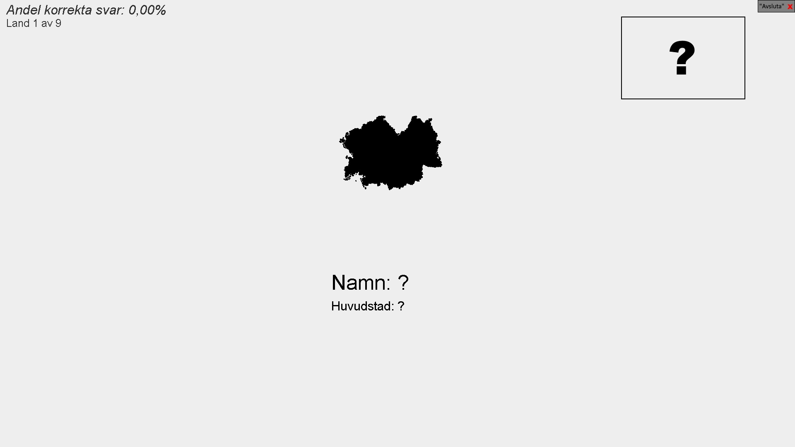
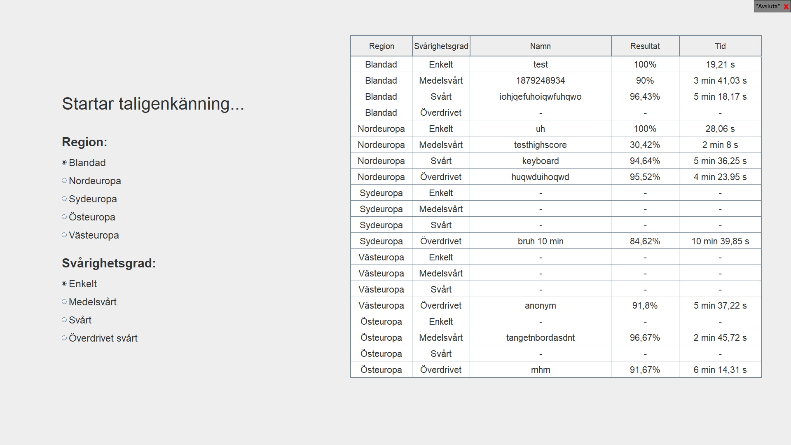

# Voice controlled geography game
A voice controlled geography/vexillology game where you test your knowledge of the flags and nations of Europe.
Made during my final year of highschool in 2019 as my "exam project" (Gymnasiearbete).

The game is controlled by speaking Swedish. The game works by using the Google [Cloud Speech-to-text API](https://cloud.google.com/speech-to-text/) and a ton of if/else statements. My free trial for the API has expired and thus the game won't work unless a new API-key is provided. If you want to try it out with your own key, you can set the path to the relevant key JSON file as the value to an environment variable named "CREDENTIALS".

The game can be controlled by keyboard in the terminal if the launch argument is "keyboardmode". The input is case-sensitive and not recommended at all, since the fundamental if/else statements are based upon the text which the Google API provides, and not based upon text input.

For more information about the game and its development, read the [report](Rapport.pdf) (swedish)

## Screenshots of the game being played at various difficulties:

### Main menu

